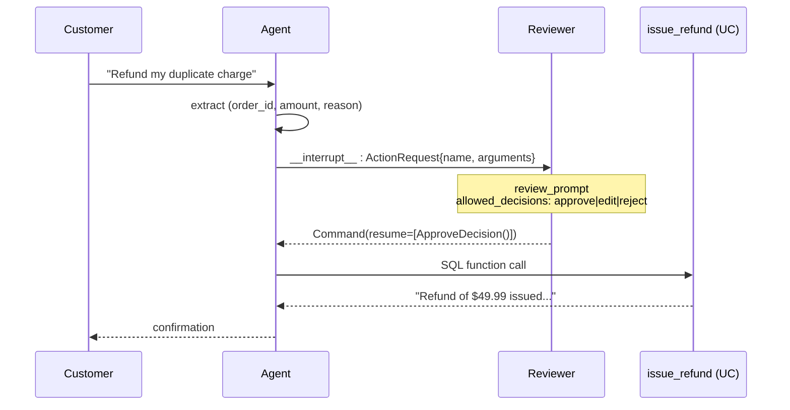

# Lab 10 -- Human in the Loop

**Level:** L200

## Goals

- Add `human_in_the_loop:` to a tool's `function:` block so the agent **pauses for human approval** before that tool runs.
- See the workflow interrupt surface as a structured `__interrupt__` payload, then resume with an **approve / edit / reject** decision via `Command(resume=...)`.
- Understand why HITL needs a checkpointer (the agent state has to survive the pause), and why DAO-AI's automatic in-memory fallback is fine for the demo but Lakebase is what production uses.

## Deliverable

A `saas-helpdesk-<your-username>` agent that, when asked to refund a duplicate charge, pauses with the proposed `(order_id, amount, reason)` arguments. Approving resumes the run and the tool returns; rejecting cancels with feedback that the agent then explains back to the customer.

---

**Use case:** `saas_helpdesk` -- the same support agent shape from Labs 5-9, but now the high-stakes action (issuing a refund) is gated by a human reviewer instead of being auto-approved.

**DAO-AI concept:** **HITL is a tool-level concern, not an agent-level one.** Drop a `human_in_the_loop:` block on any tool's `function:` -- UC function, MCP, factory, REST -- and the LangChain `HumanInTheLoopMiddleware` auto-wraps it. The agent definition doesn't change. Wherever the LLM decides to call that tool, the workflow pauses.

## What you'll learn

- `human_in_the_loop:` config: `review_prompt` + `allowed_decisions` (`approve` / `edit` / `reject`).
- The interrupt payload shape: `response["__interrupt__"]` carries the action request the workflow paused on.
- Resuming with `agent.ainvoke(Command(resume=[Decision]), config={...thread_id...})`. Decision types are `ApproveDecision()`, `EditDecision(args=...)`, `RejectDecision(message=...)`.
- Why HITL **requires a checkpointer**: state has to survive the pause. DAO-AI auto-uses `InMemorySaver()` if no `memory.checkpointer.database` is configured. Production should use Lakebase (see Lab 7).
- The Databricks Apps surface: deployed `/invocations` returns interrupts via `response.custom_outputs["interrupts"]`; the client UI collects the human decision and resumes via `custom_inputs.resume`.

## Files

| File | Purpose |
|---|---|
| `support_with_hitl.yaml` | Agent + HITL-gated `issue_refund` tool. |
| `functions/issue_refund.sql` | Idempotent UC function DDL. Lab is self-contained. |
| `notebook.py` | Provision the function, build the agent, demo approve + reject flows, deploy. |

## Prerequisites

- Unity Catalog catalog you can `CREATE FUNCTION` in.
- `databricks-claude-sonnet-4-5` endpoint enabled.
- Lab 7 (memory) is **not** required -- this lab uses the in-memory checkpointer fallback so it has zero infra dependencies beyond UC.

## Run

Open `notebook.py`. Set the `catalog` widget. The notebook walks the YAML, provisions the UC function, then exercises two HITL paths in sequence:

1. **Approve** a $49.99 duplicate refund → tool runs → agent confirms.
2. **Reject** a $200 unhappy-customer refund with manager-escalation feedback → tool is skipped → agent explains the escalation to the customer.

Deployed app name: `saas-helpdesk-<your-username>`.

## When to reach for HITL

- **Use HITL for**: refunds, account deletions, external POSTs with side effects, irreversible writes, anything you'd want a human signature on in production.
- **Skip HITL for**: read-only queries, idempotent lookups, anything time-sensitive where a pause would degrade UX.
- **Don't over-gate**: HITL on every tool turns the agent into a manual approval queue. Pick the actions where the cost of an error outweighs the latency of asking.

## Back to the workshop

[Lab 9 -- Multi-agent Orchestration](../lab-9-orchestration/) | [L300 Advanced](../../L300-advanced/) | [Workshop README](../../README.md)
